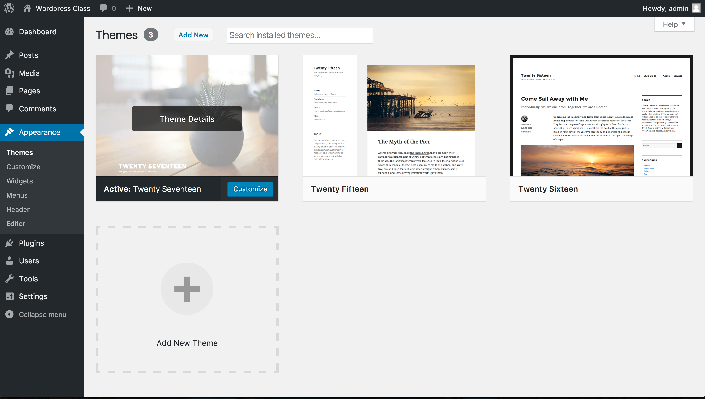

# Wordpress

## What is Wordpress?

Wordpress is a staple in the web community - it's a simple CMS (Content Management System) that allows a non-technical person to CRUD all of their website's info through an easy-to-use GUI (Graphical User Interface).

Once just a simple blogging platform, WordPress is now used on 27% of public websites - so statistically, you've got a 1 in 4 chance of needing to know how to use it.

## Set Up

1. Download Wordpress from <https://wordpress.org/latest.zip>
1. Unzip the downloaded file.
1. Place it in a local repo that you want to use for the project.
1. Point MAMP to Wordpress Directory:
	- Click on Preferences
	- Click on Web Server
	- Click the folder icon next to "Document Root" and find the unzipped wordpress directory
	- Click OK
	- Start your server by clicking "Start Servers"
1. Go to <http://localhost:8888/>
1. Choose your language
1. Click "Let's Go!"
1. Create a `wordpress` sub database in MySQL
	- Download a mysql GUI client (<http://www.sequelpro.com/download> and click download)
	- Open downloaded .dmg file
	- Drag application icon to Applications directory and double click it.
	- Click 'Socket' as your connection type
	- Fill in the following info
		- Host: 127.0.0.1 (same as localhost - this doesn't need to be filled in)
		- Username: root
		- Password: root
	- Click Connect
	- Open the Sequel Pro (Query) terminal and type `CREATE DATABASE wordpress;` (these commands do not run on `enter`)
	- Click the "Run Previous" button to run it (it might also say "Run Current")
	- In the terminal type `SHOW DATABASES;`, then click 'run' again
	- Confirm that `wordpress` is listed in the output
1. Back in your web browser, fill out the info like so:
	- Database Name: wordpress
	- User Name: root
	- Password: root
	- Database Host: localhost
	- Table Prefix: wp_
1. Click "Run the install"
1. Fill out the info on the next page and click "Install Wordpress"
1. Click "Log In"
1. Log In
1. The frontend of your will be visible at http://localhost:8888/

## Frontend Vrs. Admin

Wordpress consists of two 'halves' - the frontend side, which you see by visiting <http://localhost:8888/> and the admin panel, which you see by visiting <http://localhost:8888/wp-admin/>. The Admin panel is where you make changes to the site's appearance, content, and settings. The frontend will display those results.

In the admin panel, you'll see quite a few options for creating content - most notably Posts, Media, and Pages:

**Posts** are the equivalent of individual blog posts. Since Wordpress started as a blogging platform, they still get top billing in the menu, as well as a default place on the homepage of all default templates. Inside this menu, you'll be able to create, edit and delete your posts, as well as tag them, sort them, and assign them to categories.

**Media** acts as a repository of all media on your site - photos, video, music, etc. Anything stored here can be easily referenced using Wordpress' built-in media tools. Clicking the media link will allow you to upload, sort, and categorize all the media on your site.

**Pages** are what we think of tradtionally when it comes to web pages - you might have one for about, contact, home, etc. The pages link will allow you to create, sort, and categorize your pages. 

### What's the difference between posts and pages?

A few key differences:

**Posts** are NOT full pages - they are 'components' that can be inserted into pages - either as a whole, or as a list. There is a `single.php` file that acts as a default wrapper for any posts that is visited by itself, and don't allow you to insert custom page-specific HTML. As a result, posts are good for recurring content that has a distinct pattern and design to it. The list of most recent posts is easy to call into pages dynamically, so that no dev work is needed to update the site.

**Pages** are essentially blank HTML files that will act as a single HTML page. They're good for unique, content-rich pages that might differ visually from one another. However, they take a bit more skill to update and assign to the menu. 

## Themes

Most of your work as a developer will take place in `Appearance > Themes`. Clicking into this menu item will show a list of all the themes you have installed. You can choose which one you want to use on the frontend, as well as customize some of the options for each one:



To **really** edit these themes, though, we'll need to go into the code - specifically, `wp-content > themes`

Here you'll see a directory for each corresponding template installed. To install a new one, simply download it and put it into the `themes` directory. You'll see the theme section update automatically. 

You can find Wordpress themes virtually anywhere, [just Google it](http://lmgtfy.com/?q=wordpress+themes). 

### Customizing Themes in Code

Wordpress operates off it's own PHP concept called "The Loop" - it's essentially a For Loop that cycles through all the WP content in an if/then format. For instance, if you wanted to display all the posts you have, you would use the loop like this:

```php
	<?php 
	if ( have_posts() ) {
		while ( have_posts() ) {
			the_post(); 
			//
			// Post Content here
			//
		} // end while
	} // end if
	?>
```

The loop can be hard to write from scratch - I suggest checking out [Wordpress' documentation](https://codex.wordpress.org/The_Loop) on the subject.

Inside your current theme directory, you'll see a list of semantically-named files that correspond to different parts of the theme. These vary with each theme, but there's a few classic standards:

- `index.php`: your default home page (can be overriden in the admin panel)
- `single.php`: template for a single post page
- `header.php`: everything from opening `<html>` to opening `<body>`, and sometimes more. This is where you'll edit any meta tags or links in the header.
- `page.php`: template for a single HTML page - generally, this is just a generic wrapper that imports the page HTML into it
- `footer.php`: everything from `</body>` to `</html>`. Useful for adding in scripts that will be included on every page, or copyright information.

As previously stated, the inclusion of and fucntion for these pages vary from template to template. You'll want to read any documentation provided in order to fully grasp how your template works.

#### Calling Partials

Every component of your Wordpress site can be summoned into your theme templates by calling their name in your PHP code. Here's a few examples of useful calls that come up often:

- `get_header()`
	- display header
- `is_home()`
	- is home page
- `is_front_page()`
	- is this the front page (single page to display, not containing articles
- `get_sidebar()`
	- display sidebar
- `get_footer()`
	- display footer
- `bloginfo('name')`
	- name of blog
- `bloginfo('description')`
	- description of blog
- `have_posts()`
	- are there posts left to display?
- `the_post()`
	- pull up the next post in the queue
- `the_posts_pagination()`
	- show next/previous buttons on post lists
- `have_comments()`
	- does the article have comments?
- `comments_open()`
	- are people allowed to comment?
- `the_author()`
	- display author of the article
- `the_title()`
	- display the title of the article
- `the_content()`
	- display the body of the article
- `the_permalink()`
	- display permalink for the article

> Note: Functions that start with `the_` can usually be prepended with or replaced by `get_`.  When this is done, value is returned, not printed

### Customizing Themes in the Admin Panel

Many themes are designed specifically to not have to be edited by hand. The Admin panel itself has many options for your theme:

- **Customize**: Edit preset features for your theme, in a easy-to-use GUI. The depth of customization here can vary from a few color values, to dozens of pages of tweaks and features. Check here first before editing the code!

- **Widgets**: Widgets are single-function code snippets that can be placed in sidebars and other 'widget-friendly' areas (these will be defined by the theme, and displayed to the right of the available widgets). Some examples are a calendar, a search box, recent posts, or a tag cloud. 

- **Menus**: To make a menu in Wordpress, you first have to create a menu here - it's basically a dynamic list of pages/categories/links that you would like grouped together. Each menu can then be assigned to a specific area - like the primary navigation, footer, or sidebar.

- **Header (or custom)**:  Similar to Customize, only specifically relegated to the home header section. Here you can change the background image of your template header. This might be different or non-existent in other themes. 

- **Editor**: Edit the CSS of the template directly. You'll probably want to do this in your local repo, with your code editor of choice - but keep in mind that some clients might rather you make changes in the admin panel so that they can continue to do so after you hand the project off.

## Plugins

There's a menu option for plugins in the Wordpress Main menu - these are a collection of third-party apps that perform functions ranging from filtering spam to adding eCommerce functionality to your site. Think of these as Wordpress-specific NPM Packages - they can be added in easily to augment the functionality of your site.

You can find Wordpress plugins by searching online, or by clicking 'Add New' and using the search feature built into the GUI. You can even write your own and upload them into the `wp-content > plugins" directory.

## Users

If lots of people are going to be using or contributing to this site, it's probably a good idea to make each one a user, and edit their access abilities:

- Administrator – somebody who has access to all the administration features within a single site. (Protip: only you)
- Editor – somebody who can publish and manage posts including the posts of other users.
- Author – somebody who can publish and manage their own posts.
- Contributor – somebody who can write and manage their own posts but cannot publish them.
- Subscriber – somebody who can only manage their profile.

## Tools

The most important component of Tools is the import/export option. Everything you write and publish on Wordpress is saved into a SQL database, making it easy to back up and move website locations. Every piece of content is completely seperate from your code and theme, so if your entire site gets deleted, you can easily have it up and running again in minutes with a proper backup.

- **Export**: Allows you to download a SQL table of your entire Wordpress site. I highly suggest doing this every 3 months or so, depending on how frequently your site is updated. Your DB will not be backed up via Git, so its essential that you keep multiple copies of it just in case.

- **Import**: Allows you to upload a Wordpress SQL table, essentially restoring a lost site. Keep in mind though that Wordpress can only run on one DB at a time - you'll have to either overwrite or permanently join your tables in order to update it. 

## Settings

These settings are a little more forward-facing than you might think. For instance, `Settings > General` is the only place to change the name of your website. Here's a rough breakdown:

- General
	- Site Name
	- Site URL
	- Admin Email Address
	- Timezones (for automated posting)

- Reading
	- Set your home page (very important)
	- Set number of posts to display on summary page
	- Content of feed
- Discussion
	- Comment settings
		- Who can comment
		- How long the discussion is open for
		- Nesting comments
		- How many comments per page of comments
		- Comment notification
		- Comment moderation settings
- Media
	- Set the crop sizes for different image uses in your post
- Permalinks
	- customize how your URL string is used for posts - generally, you'll want this to read well and follow good SEO practices.


## Conclusion

This is obviously just the tip of the iceberg - Wordpress is a massive ecosystem that will take lots of practice to master. However, you now know enough to get started - and probably enough to take a small gig fixing a Wordpress site!

